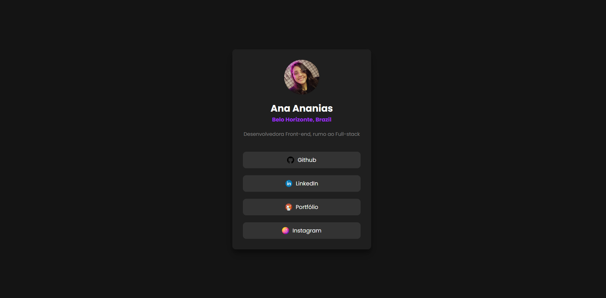

# Social Links Hub 🔗


> Uma página de links responsiva inspirada em Linktree, desenvolvida para praticar HTML e CSS.

### ✨ [Veja o site ao vivo aqui!](https://anaflgg.github.io/social-links-landing-page/)

---

### 📸 Screenshot



---

### 📖 Sobre o Projeto

Este projeto consiste em uma página simples para centralizar links de redes sociais e contatos.

Foi desenvolvido com foco em praticar conceitos fundamentais de HTML e CSS, como estruturação semântica, estilização e responsividade.

---

### 🚀 Tecnologias Utilizadas

- HTML5
- CSS3
- Flexbox
- Media Queries
- Google Fonts (Poppins)

---

### 🧠 O que eu pratiquei

- Estruturação semântica com HTML
- Centralização de elementos com Flexbox
- Criação de layout responsivo
- Uso de variáveis CSS (`:root`)
- Organização e reutilização de estilos

---

### 👷 Como executar o projeto

Este é um projeto estático, não precisa instalar nada.

1. Clone o repositório:
```bash
git clone https://github.com/anaflgg/social-links-landing-page.git
